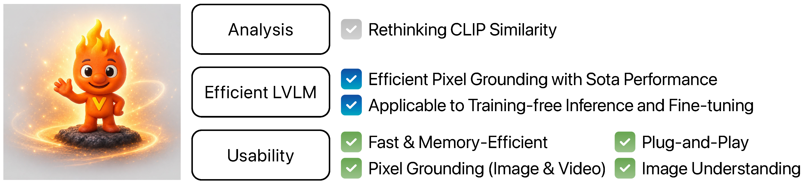

<div align="center">
  
</div>

<h1 align="center">
CLIP Tricks You: Training-free Token Pruning for Efficient Pixel Grounding in Large Vision-Language Models
</h1>

<p align="center">
  <a href="https://childult-programmer.github.io/LiteLVLM.github.io/">
    
  </a>
  <a href="https://arxiv.org/abs/2605.13178">
    
  </a>
  <a href="https://github.com/sejong-rcv/LiteLVLM">
    
  </a>
  <a href="https://litelvlm-demo.com/">
    
  </a>
</p>

<p align="center">
  <a href="https://scholar.google.com/citations?hl=ko&view_op=list_works&gmla=AIqSsVtReIryhTuSPRawrTwYvu9NA-xEVwFSQW5_enptxY4xswt0mimpMdlTRMNcsPGnnHCtNuzk0T4gDErqakULVV1Df2sHd23GlASjg1SNvGtkgQ&user=MO_dSVUAAAAJ">Sangin Lee</a>
  &nbsp;and&nbsp;
  <a href="https://scholar.google.com/citations?user=vMrPtrAAAAAJ&hl=en">Yukyung Choi</a>
</p>

---

<h2 id="news">📜 News</h2>

* 🚀 **[2026/06/20]** We released the live demo page. Try it now!
* 🌐 **[2026/06/15]** The project page is now online.
* 🔥 **[2026/05/07]** Our code is now open source.
* 🎉 **[2026/05/01]** LiteLVLM was accepted to ICML 2026!

---

<h2 id="outline">📢 Outline</h2>

1. [Highlights](#highlights)
2. [Installation](#installation)
3. [Datasets](#datasets)
4. [Model Zoo](#model-zoo)
5. [Evaluation](#evaluation)
6. [Citation](#citation)
7. [Acknowledgement](#acknowledgement)

---

<h2 id="highlights">
  
  Highlights
</h2>

<table>
  <tr>
    <td width="33%" align="center">
      <b>⚡ Faster Inference</b>
      <br><br>
      LiteLVLM accelerates LVLM inference by pruning unnecessary visual tokens.
    </td>
    <td width="33%" align="center">
      <b>🔍 Key Observation</b>
      <br><br>
      Object tokens are not always the most similar tokens to the input text.
    </td>
    <td width="33%" align="center">
      <b>🎯 Pixel Grounding</b>
      <br><br>
      LiteLVLM preserves segmentation quality while reducing token computation.
    </td>
  </tr>
</table>

<br>

* LVLMs can process hundreds or thousands of visual tokens, making inference slow and memory-intensive.
* We observe that <strong>visual tokens inside the target object can be surprisingly less similar to the input text</strong>.
* LiteLVLM leverages this insight to efficiently segment text-described objects at the pixel level.

<br>

<div align="center">
  
</div>

---

<h2 id="installation">🛠️ Installation</h2>

1. Clone this repository.

```bash
git clone https://github.com/sejong-rcv/LiteLVLM.git
cd LiteLVLM
```

2. Set up a conda environment and install the required packages.

```bash
conda create -n LiteLVLM python=3.10 -y
conda activate LiteLVLM

pip install torch==1.13.1+cu117 torchvision==0.14.1+cu117 --extra-index-url https://download.pytorch.org/whl/cu117
pip install -r requirements.txt
pip install flash-attn==2.3.6 --no-build-isolation
```

3. Install MMCV.

```bash
git clone https://github.com/open-mmlab/mmcv
cd mmcv
git checkout v1.4.7
MMCV_WITH_OPS=1 pip install -e .
```

---

<h2 id="datasets">📌 Datasets</h2>

Please see [`docs/datasets.md`](docs/datasets.md) for dataset preparation guidelines.

---

<h2 id="model-zoo">🧩 Model Zoo</h2>

We use the official pretrained checkpoints released by [GLaMM](https://github.com/mbzuai-oryx/groundingLMM/blob/main/docs/model_zoo.md).

Download `GLaMM-RefSeg` from Hugging Face and place it in `checkpoints/`.

If you plan to fine-tune LiteLVLM, please additionally download the `GLaMM-GranD-Pretrained` checkpoint.

---

<h2 id="evaluation">⚡ Evaluation</h2>

Run the following example to evaluate LiteLVLM on Referring Expression Segmentation benchmarks.

<details>
<summary>1. Prepare the pretrained checkpoints and datasets.</summary>

<br>

* Check [`Model Zoo`](#model-zoo) to download the pretrained pixel grounding model checkpoints to `./checkpoints/`.
* Check [`Datasets`](docs/datasets.md) to set up the datasets.

</details>

<details>
<summary>2. Run the evaluation script.</summary>

<br>

```bash
#!/bin/bash

export CUDA_VISIBLE_DEVICES=0
export PYTHONPATH="./:$PYTHONPATH"
MASTER_PORT=22999

CKPT_PATH=$1
REF_SEG_DATASET=$2
RESULT_PATH=$3
RETAIN_TOKENS=$4

deepspeed --master_port="$MASTER_PORT" eval/referring_seg/infer_and_evaluate.py \
    --version "$CKPT_PATH" \
    --refer_seg_data "$REF_SEG_DATASET" \
    --results_path "$RESULT_PATH" \
    --num_retain_tokens $RETAIN_TOKENS \
    --pretrained
```

To evaluate the **RefCOCO** benchmark with **192 retained tokens**, run:

```bash
bash eval/referring_seg/single_evaluation.sh 'checkpoints/GLaMM-RefSeg' 'refcoco|val' 'run/LiteLVLM/192' 192
```

</details>

<details>
<summary>3. Run one-click evaluation.</summary>

<br>

To evaluate all benchmarks, run:

```bash
bash eval/referring_seg/run_evaluation.sh 'checkpoints/GLaMM-RefSeg' 'run/LiteLVLM/192' 192
```

</details>

---

<h2 id="citation">📚 Citation</h2>

If you use LiteLVLM in your research, please cite our work using the following BibTeX entry:

```bibtex
@article{lee2026clip,
  title={CLIP Tricks You: Training-free Token Pruning for Efficient Pixel Grounding in Large Vision-Language Models},
  author={Lee, Sangin and Choi, Yukyung},
  journal={arXiv preprint arXiv:2605.13178},
  year={2026}
}
```

---

<h2 id="acknowledgement">🙏 Acknowledgement</h2>

We thank [GLaMM](https://github.com/mbzuai-oryx/groundingLMM) and [VideoGLaMM](https://github.com/mbzuai-oryx/VideoGLaMM) for releasing their code as open source.
